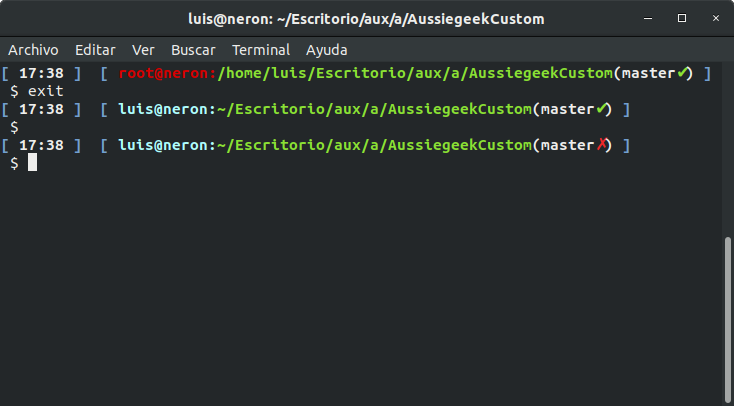

# AussiegeekCustom
I just to install zsh for nth time, and every time i do it i use aussiegeek but i change some parameters, to avoid send my again this file via e-mail I have created this repository

